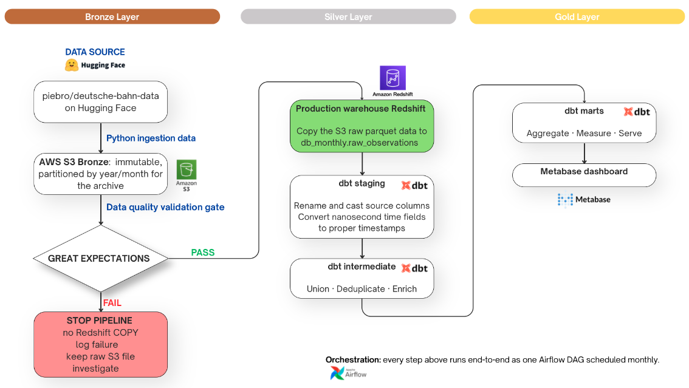
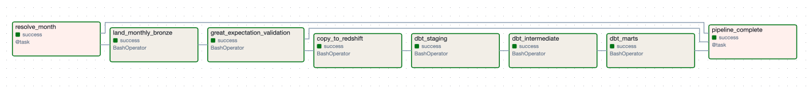
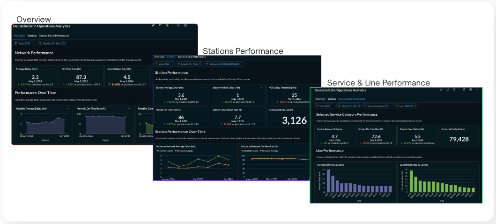

#  Deutsche Bahn Operations Analytics Pipeline

A batch data platform that turns Deutsche Bahn's delay data into a tested,
modeled warehouse — surfaced through a daily/monthly performance dashboard.

> **Status: monthly pipeline live end-to-end, orchestrated by Airflow.**
> Hugging Face → S3 (Bronze) → Great Expectations → Redshift Serverless →
> dbt (staging → intermediate → Gold marts) → Metabase dashboard, all
> scheduled by an Airflow DAG. Validated on 101.7M rows
> (January–July 2026). See [Status](#status) for what's next.

---

## Problem statement

Deutsche Bahn publishes delay data as a **poll-and-snapshot** feed: the
same train stop can be captured multiple times as its delay and
cancellation state evolve, so the raw data isn't analysis-ready on its
own. This project builds a reproducible pipeline that turns those raw
observations into validated, deduplicated, modeled datasets answering:
*which stations and lines are delayed, how often, and how badly — daily
and month over month.*

**Built for:** transport planners (monthly trend reporting), operations
teams (daily monitoring), and performance analysts (both) — answering
questions like *which stations see the most delay, which lines cancel
most often, and is performance improving or deteriorating month over
month.*

### Key profiling insights

- **Schema stability** — all seven months use the same 17-column schema, with no observed schema drift.
- **Legitimate negative delays** — early departures and arrivals appear as negative delays and should not be treated as data errors.
- **Structural nulls** — missing values are often explained by railway semantics rather than poor data quality.
- **Train-type dependency** — `line_number` is systematically null for several long-distance train types, such as ICE, IC, and EC.
- **Arrival/departure structure** — around 7–8% of arrival or departure timestamps are null, but every observation contains at least one planned event.
- **Profiling outcome** — profiling converted raw-data behavior into evidence-based transformation and data-quality rules for the pipeline.

---

## Architecture

Bronze → Silver → Gold (Medallion), scheduled batch, no streaming
infrastructure — the data arrives on a monthly/6-hourly cadence, not
continuously. This is the currently implemented path (running code, not
a plan):



**Orchestration:** every step above runs end-to-end as one Airflow DAG
(`db_monthly_pipeline`), scheduled monthly.



For the full pipeline diagrams (including the target architecture once
the raw-API/daily leg is added), the reasoning behind every tool choice,
and known data-quality realities baked into the design, see
**[docs/architecture.md](docs/architecture.md)**.

---

## Status

| Component | Status |
|---|:---:|
| Monthly ingestion → S3 Bronze → Great Expectations → Redshift | ✅ Implemented |
| dbt staging → intermediate → Gold marts (station/line performance) | ✅ Implemented |
| Metabase dashboard (reads Gold marts directly) | ✅ Implemented |
| Airflow orchestration (monthly pipeline, end-to-end) | ✅ Implemented |
| Raw API ingestion (6-hourly), structural parser (Spark) | ⏳ Planned |
| Monthly reconciliation vs. official HF release | ⏳ Planned |
| ML delay prediction | ⏳ Advanced / stretch, after reporting is solid |

**Data scale:** 101,702,091 observations · 7 monthly files (Jan–Jul
2026) · 212 service days · ~5,453 EVA station codes · a stable
17-column schema with zero observed drift across the window.

**Quality gates:** 33 pytest tests (parsers/SQL builders) · 5 Great
Expectations checks (Bronze structural gate) · 50 dbt tests (staging
through Gold) — every threshold traces back to the profiling evidence
above, not a guessed bound.

---

## Gold analytics layer

The dashboard and any future consumer (API, ML features) read these
dbt models only — never Bronze or raw Parquet directly:

```text
dim_station               one row per station, keyed on eva
dim_train_line             one row per (train_type, line_number)
dim_service_month          calendar dimension for dashboard filters

mart_monthly_station_perf  station-month delay / on-time / cancellation
mart_monthly_line_perf     line-month delay / on-time / cancellation
```

Both marts expose observation count, average/median delay, on-time
rate, cancellation rate, and an `eligible_for_ranking` flag (≥30
observations) so a single-outlier station or line can't top a
"worst performer" ranking.

---

## Dashboard

The Gold marts are consumed by an interactive **Metabase dashboard**,
built entirely by scripting Metabase's REST API
(`dashboard/setup_metabase.py`).



- **Overview** — network-level KPIs and month-over-month trend.
- **Stations** — per-station delay/on-time/cancellation, ranked and
  compared against the network average.
- **Service & Line** — the same metrics sliced by train category and
  line.

Filters (year, month, station, train category, line) apply across all
three tabs.

**Video walkthrough coming soon.** A short dashboard demonstration will
be added here for the final project presentation.

---

## Cost engineering: staying inside the AWS credit

The project runs on a **$160 AWS credit**. Redshift Serverless bills by
usage and auto-pauses when idle — but it *resumes* on every query it
receives, including every Metabase dashboard sync and every card edit
made while iterating on layout. That churn during dashboard development
pushed spend as high as **~$215**, over budget, almost entirely from
Redshift.

**Fixes:**

- **Base capacity trimmed to 8 RPU** — the minimum Redshift Serverless
  allows — cutting the per-second cost of every resume and active
  window.
- **Local Postgres mirror** — a container already wired into
  `docker-compose.yml` mirrors the Gold marts, and Metabase is pointed
  at it while iterating on dashboard layout/filters, so only the
  scheduled pipeline and final verification touch Redshift Serverless.
  This is a disposable dev-time mirror, not a second warehouse —
  Redshift Serverless remains the only warehouse target (see
  [ADR: Redshift Serverless as warehouse](docs/adr/0002-redshift-serverless-as-warehouse.md)).

```text
Redshift Gold marts
        │
        ▼
Local PostgreSQL mirror
        │
        ▼
Metabase development
```

Full mirroring runbook: [dashboard/local-postgres-mirror.md](dashboard/local-postgres-mirror.md).

---

## Tech stack

| Area | Tool |
|---|---|
| Ingestion | Python 3.11, boto3, huggingface_hub |
| Bronze storage | AWS S3 |
| Bronze validation | Great Expectations |
| Warehouse | Redshift Serverless |
| Transformations | dbt (`dbt-redshift`) |
| Orchestration | Airflow (Docker) |
| Dashboard | Metabase, reading Gold marts directly |
| Local dev mirror | Postgres (Docker, dashboard iteration only) |
| Testing | pytest, dbt tests |
| Dependency management | uv |

Planned, not yet implemented: raw API ingestion, Spark structural
parser, monthly reconciliation, ML delay prediction. Full rationale for
every tool choice: [docs/architecture.md](docs/architecture.md#4-why-each-tool-was-chosen).

---

## Repository structure

```text
.
├── ingestion/monthly_load/     # Hugging Face Parquet → S3 Bronze landing
├── quality/bronze_monthly/     # Great Expectations suite for the Bronze gate
├── warehouse/
│   ├── redshift_load/          # COPY Bronze Parquet → Redshift raw table
│   └── dbt/models/             # staging/ → intermediate/ → marts/
├── airflow/dags/                # db_monthly_pipeline DAG
├── dashboard/                   # setup_metabase.py + local Postgres mirror docs
├── notebooks/data-assessment/  # Spark profiling notebooks (evidence, not pipeline code)
├── docs/                        # architecture, runbook, ADRs, diagrams
├── tests/unit/                  # pytest: parsers, SQL builders, GE config
└── docker-compose.yml
```

---

## Quickstart

**Prerequisites:** Python 3.11, [`uv`](https://docs.astral.sh/uv/), Docker
+ Docker Compose, an AWS account with an S3 bucket and a Redshift
Serverless workgroup.

```bash
# 1. Install dependencies
uv sync --extra ingestion --extra quality --extra warehouse --extra dev

# 2. Configure environment
cp .env.example .env   # fill in AWS/Redshift credentials

# 3. Bring up orchestration (Airflow) and, optionally, the local Postgres mirror
docker compose up -d

# 4. Trigger the monthly pipeline (land → validate → load → dbt build)
#    via the Airflow UI at http://localhost:8080, DAG `db_monthly_pipeline`,
#    or run each step by hand — see docs/runbook.md

# 5. Build the Metabase dashboard against the Gold marts
docker compose up -d metabase
uv run python dashboard/setup_metabase.py
```

Full operational detail — failure handling, required Redshift grants,
troubleshooting — is in [docs/runbook.md](docs/runbook.md).

---

## Documentation

- [docs/architecture.md](docs/architecture.md) — data architecture, pipeline
  diagrams, and tool choices
- [docs/runbook.md](docs/runbook.md) — operational manual: running the
  pipeline, handling failures, managing the environment
- [docs/adr/](docs/adr/) — architecture decision records
- [dashboard/local-postgres-mirror.md](dashboard/local-postgres-mirror.md) —
  the Redshift-cost workaround described above, in full

This README evolves with the actual implementation rather than
documenting components that have not yet been built.
