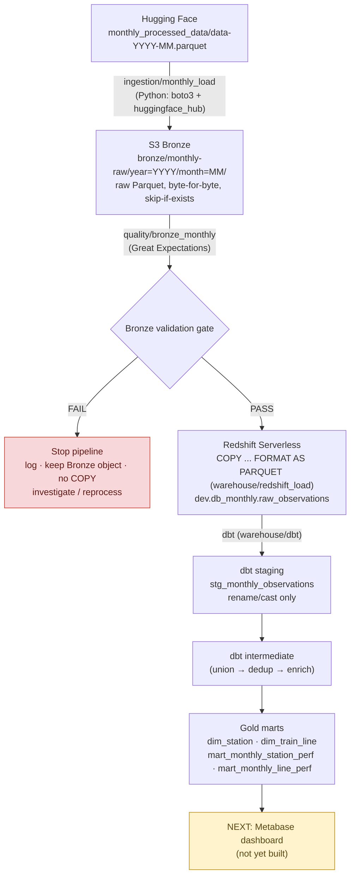
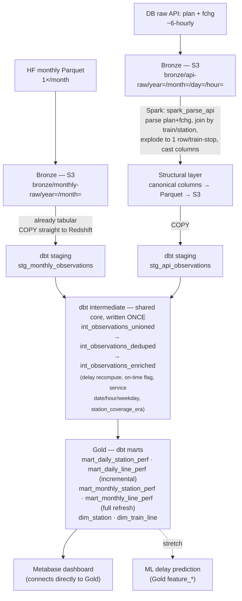

# Architecture

## 1. Pattern

**Medallion architecture (Bronze → Silver → Gold), scheduled incremental
batch.** Two independent batch sources — a monthly Hugging Face Parquet
release and a ~6-hourly Deutsche Bahn API poll — land in Bronze unchanged,
converge on one canonical observation schema, and are modeled once in dbt.
There is no continuous event stream, so there is no Kafka or Spark
Structured Streaming in this design.

| Layer | Storage | Role |
|---|---|---|
| Bronze | S3, immutable | Raw source bytes, unchanged, partitioned |
| Silver | Redshift Serverless, dbt staging + intermediate | Conform, dedupe, compute business rules |
| Gold | Redshift Serverless, dbt marts | Reporting-ready star schema |
| Serving | Metabase (dashboard, connects directly to Gold) | Reads Gold only |

## 2. Currently implemented path (monthly)

Everything below is running code, not a plan.

**Bronze validation gate checks, in order:**

1. Object is valid, readable Parquet
2. Row count ≥ 1
3. Schema is exactly the 17 confirmed columns, in order
4. 10 columns confirmed always-populated by profiling are still non-null
5. `time` values fall inside their own source month

**Landing table notes:** `raw_observations` holds the 17 source columns
plus `source_month`; the five timestamp columns land as raw
nanosecond-epoch `BIGINT`, not auto-decoded by the `COPY`.

Validated as of the last load: 101,702,091 rows across January–July 2026,
`id` confirmed unique within and across all loaded months.

## 3. Target architecture

Both staging models are deliberately thin (rename/cast only) — the union
of both sources happens *inside* dbt intermediate, so downstream rules are
written exactly once.

**Cross-cutting, scheduled by Airflow:** `api_pull` (6-hourly) ·
`monthly_load` · `spark_parse` · `dbt build` · `monthly_reconcile`.

**Data quality, split by layer:** Great Expectations gates Bronze
(freshness, status code, non-empty payload); dbt tests gate staging
(not-null, types), intermediate (key uniqueness, delay sanity bounds), and
marts (row-count deltas, assertions).

## 4. Why each tool was chosen

| Tool | Role | Why |
|---|---|---|
| **S3** | Bronze landing | Cheap, durable, immutable object storage; a parser bug is recoverable by reprocessing, not re-pulling the source |
| **Redshift Serverless** | Silver + Gold warehouse | Single SQL warehouse target; auto-pause keeps a limited AWS credit budget usable; no need for a second warehouse product |
| **dbt-redshift** | All business logic — dedup, delay calc, dimensions, marts | Version-controlled SQL with built-in testing, docs, and lineage; both ingestion paths converge here so rules are written exactly once instead of duplicated per source |
| **PySpark** | Structural parsing of the raw API's `plan`/`fchg` payloads only | Parsing and joining nested XML/JSON is awkward in SQL and natural in Spark; not used on the monthly path (already flat/typed) and not used for business logic |
| **Great Expectations** | Bronze structural gate | Distinct concern from dbt tests — "did the payload arrive intact and match the expected shape," not "is the business rule correct" |
| **Airflow** | Orchestration (planned) | Scheduled batch DAGs fit the 6-hourly/monthly cadence; no need for a streaming scheduler |
| **Metabase** | Serving (planned) | Connects directly to Gold marts; no business logic lives in the dashboard — `avg_delay_min`, `on_time_rate`, `eligible_for_ranking`, etc. are used as computed, never redefined in Metabase |

## 5. Key architectural rules

- **Spark owns structure, dbt owns semantics.** Spark's scope stops at
  "make it tabular and match the canonical schema." Dedup, delay
  recomputation, dimensions, and source precedence all live in dbt
  intermediate — never in the structural parser.
- **Both sources are unioned inside dbt intermediate**, not upstream —
  this makes "shared logic, written once" structural, not a matter of
  discipline.
- **Bronze is immutable.** A validation failure stops the pipeline before
  the Redshift `COPY`; it never deletes or mutates the landed object.
- **The Gold marts are the contract.** The API and dashboard never read
  Bronze or the raw landing table directly.
- **Data quality is split by layer, not duplicated:** Great Expectations
  gates Bronze structure; dbt tests gate staging/intermediate/mart
  semantics; a monthly reconciliation job checks correctness against the
  official Hugging Face release.

## 6. Known data-quality realities carried through the design

| Reality | How the design handles it |
|---|---|
| The publicly documented monthly schema (16 columns) is stale — actual files have 17 (`train_name` replaced by `train_number` + `line_number`) | Schema is checked as a hard gate on every load, never assumed |
| Source grain is **snapshot-level**, not final-state — the same `train_line_ride_id` + `train_line_station_num` can appear multiple times as delay, timestamps, and cancellation status evolve | Deduplication to one row per train-stop happens in `int_observations_deduped` (not yet built), never in Bronze or staging |
| A station-coverage break exists in the source history (a smaller set of major stations before a given date, all reachable stations after) | Carried through as a `station_coverage_era` flag so trend charts never silently compare incomparable periods |
| Timestamps arrive as raw nanosecond-epoch integers | Land in Redshift as `BIGINT`, decoded to naive (Europe/Berlin wall-clock) `TIMESTAMP` in staging — keeping the raw landing table byte-faithful to Bronze |
